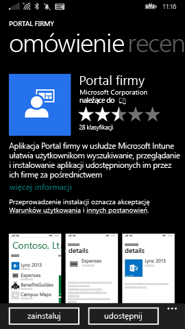

# Rejestrowanie urządzenia z systemem Windows Phone 8.1 w usłudze Intune  

Rejestrować urządzenia w celu uzyskania dostępu do pracy lub szkolny adres e-mail, plików i innych zasobów. Po zarejestrowaniu urządzeń organizacja może zapewnić bezpieczeństwo danych firmowych. Aby uzyskać więcej informacji o rejestracji, zobacz [Co się dzieje w przypadku zainstalowania aplikacji Portal firmy i zarejestrowania urządzenia w usłudze Intune?](what-happens-if-you-install-the-company-portal-app-and-enroll-your-device-in-intune-windows.md) i [Lista rzeczy, jakie dział pomocy technicznej Twojej firmy może zobaczyć na Twoim urządzeniu i jakich nie może](what-info-can-your-company-see-when-you-enroll-your-device-in-intune.md).  

Aby zarejestrować urządzenie w usłudze Intune, postępuj zgodnie z zestawu instrukcji, które są zgodne z uprawnienia lub stan bieżącego konta.

## Rejestrowanie za pośrednictwem portalu firmy  
Po zainstalowaniu aplikacji Portal firmy od Microsoft Store, wykonaj następujące kroki. 

1.  Naciśnij kolejno pozycje **Start** > **Sklep**.  

2.  Naciśnij pozycję **Wyszukaj** i wpisz **portal firmy**.  

3.  Na liście wyników naciśnij pozycję **Portal firmy**.  

      

4.  Naciśnij kolejno pozycje **Portal firmy** &gt; **Zainstaluj**.  

      

Rejestrowanie urządzenia:  

1.  Na urządzeniu otwórz aplikację **Portal firmy Microsoft Intune**.  

2.  Wprowadź swoje poświadczenia. Może pojawić się monit o zaakceptowanie firmowych warunków użytkowania (jeśli mają one zastosowanie).  

3.  Szybko przesuń palcem po ekranie, aby przejść do elementu **Moje urządzenia**.  

4.  Wybierz pozycję **Naciśnij, aby zarejestrować lub zidentyfikować to urządzenie**.  

      

5.  Naciśnij pozycję **Zarejestruj to urządzenie**.  

      

6.  Naciśnij pozycję **Dodaj konto**.  

      

7.  Wprowadź żądane dodatkowe informacje, a następnie naciśnij pozycję **Zaloguj**, aby zakończyć rejestrację. Konto w miejscu pracy powinno być teraz wyświetlane na stronie otwieranej po wybraniu pozycji **Ustawienia** &gt; **Miejsce pracy**.  

      

## Rejestrowanie za pomocą ustawień aplikacji  
Wykonaj następujące kroki, jeśli nie masz dostępu do Microsoft Store na urządzeniu Windows Phone lub jeśli nie masz Account firmy Microsoft.

1.  Naciśnij kolejno pozycje **Ustawienia** &gt; **Miejsce pracy**.  

2.  Naciśnij pozycję **Dodaj konto**, a następnie zaloguj się przy użyciu swojego konta służbowego.  

3.  Wprowadź żądane dodatkowe informacje, a następnie naciśnij pozycję **Zaloguj**, aby zakończyć rejestrację.  

4.  Jeśli zostanie wyświetlony monit o zainstalowanie aplikacji lub centrum firmy, upewnij się, że odpowiednie pole wyboru zostało zaznaczone, a następnie naciśnij pozycję **Gotowe**.  

Jeśli dział pomocy technicznej Twojej firmy skonfigurował Portal firmy tak, aby został zainstalowany podczas rejestracji, Portal firmy pojawi się na liście aplikacji.  

Nadal potrzebujesz pomocy? Skontaktuj się z pomocą techniczną Twojej firmy. Informacje kontaktowe są dostępne w [witrynie sieci Web Portal firmy](https://go.microsoft.com/fwlink/?linkid=2010980).
