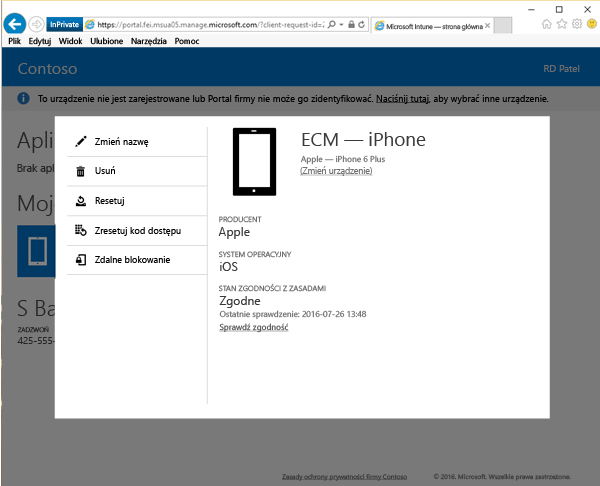

# Zmiana nazwy urządzenia z poziomu witryny sieci Web Portal firmy

Możesz zmienić nazwę urządzenia w celu ułatwienia jego identyfikacji. Możesz to zrobić z poziomu [witryny sieci Web Portal firmy](https://portal.manage.microsoft.com#HelpDeskDialog). Witryna sieci Web Portal firmy to strona internetowa umożliwiająca zarządzanie komputerami i urządzeniami zarejestrowanymi w usłudze zarządzania przez dział IT firmy.

Aby zmienić nazwę urządzenia:

1.  W [witrynie sieci Web Portal firmy](https://portal.manage.microsoft.com#HelpDeskDialog) naciśnij przycisk __menu__ , a następnie wybierz pozycję __Moje urządzenia__.

2. Na stronie __Moje urządzenia__ wybierz urządzenie, którego nazwę chcesz zmienić.

  

3.  Urządzenie wyświetli się w oknie podręcznym. Naciśnij przycisk **Zmień nazwę**.

    

4.  W polu z nazwą urządzenia wpisz nową nazwę dla danego urządzenia, a następnie naciśnij przycisk **Zmień nazwę**. Urządzenie będzie teraz widoczne z nową nazwą.

Nadal potrzebujesz pomocy? Skontaktuj się z pomocą techniczną Twojej firmy. Informacje kontaktowe są dostępne w [witrynie sieci Web Portal firmy](https://portal.manage.microsoft.com#HelpDeskDialog).
