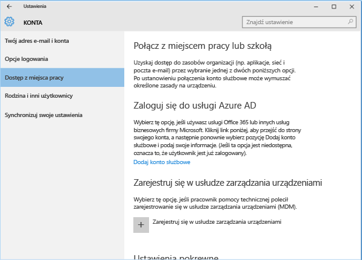
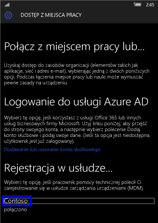
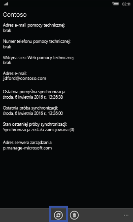
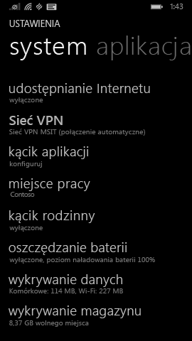
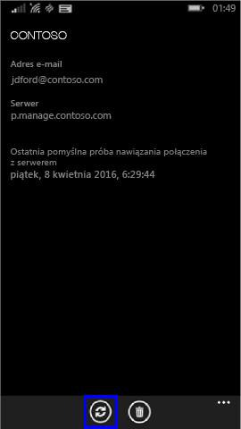

# Ręczne synchronizowanie urządzenia z systemem Windows

W przypadku niezadowalającej prędkości instalacji aplikacji należy zainicjować ręczną synchronizację urządzenia. Ręczna synchronizacja wymusza połączenie urządzenia z usługą Intune w celu pobrania najnowszych aktualizacji i wiadomości. Po ukończeniu synchronizacji urządzenia prędkość instalacji może wzrosnąć.

Usługa Intune obsługuje ręczną synchronizację z aplikacji Portal firmy, paska zadań na pulpicie i aplikacji Ustawienia na urządzeniu. Funkcje aplikacji Portal firmy są obsługiwane na urządzeniach z systemem Windows 10 z aktualizacją Creator’s Update (1703) lub nowszą. 

Za pomocą aplikacji Ustawienia na urządzeniu można synchronizować wszystkie urządzenia z systemem Windows, w tym:

* [Windows 10 Desktop](#windows-10-desktop)  
* [Microsoft HoloLens](#microsoft-hololens)   
* [Windows 10 Mobile](#windows-10-mobile)  
* [Windows Phone 8.1](#windows-phone-81)    

## Synchronizacja bezpośrednio z aplikacji Portal firmy dla systemu Windows
Wykonaj następujące kroki, aby ręcznie zsynchronizować wszystkie urządzenia z systemem Windows 10 zawierającym aktualizację Creator’s Update (wersja 1703) lub nowszą.

1. Otwórz aplikację Portal firmy na urządzeniu.

2. Wybierz **Ustawienia** > **Synchronizacja**.

      
    
      

## Synchronizacja z paska zadań urządzenia lub menu Start   

Sterowanie synchronizacją jest także dostępne spoza aplikacji — z pulpitu urządzenia. Jeśli aplikacja została przypięta bezpośrednio do paska zadań lub menu Start, można szybko wykonać synchronizację.  

1. Znajdź ikonę aplikacji Portal firmy na pasku zadań lub w menu Start.  
2. Kliknij prawym przyciskiem myszy ikonę aplikacji, aby wyświetlić jej menu (tzw. listę szybkiego dostępu).  

      

3. Wybierz pozycję **Synchronizuj to urządzenie**. Spowoduje to otwarcie aplikacji Portal firmy na stronie **Ustawienia** i zainicjowanie synchronizacji.  

## Synchronizacja z ustawień aplikacji 
Wykonaj następujące kroki, aby ręcznie zsynchronizować urządzenia Microsoft HoloLens, Windows 10 Desktop, Windows 10 Mobile lub Windows Phone 8.1 przy użyciu aplikacji Ustawienia.  

### Windows 10 Desktop
1. Na urządzeniu wybierz opcje **Start** > **Ustawienia**.

2. Wybierz pozycję **Konta**.

      

3. Istnieje wiele wersji systemu Windows 10 na komputery stacjonarne. Porównaj swój ekran z przedstawionymi poniżej zrzutami, aby określić czynności do wykonania. 

    * Jeśli na ekranie jest wyświetlany napis**Uzyskaj dostęp do miejsca pracy lub nauki**, przejdź do procedury w sekcji [Uzyskaj dostęp do miejsca pracy lub nauki](#access-work-or-school-steps).

      

    * W przypadku napisu **Dostęp z miejsca pracy** przejdź do procedury w sekcji [Dostęp z miejsca pracy](#work-access-steps).  

    

#### Czynności dla opcji Uzyskaj dostęp do miejsca pracy lub nauki

1. Wybierz **Uzyskaj dostęp do miejsca pracy lub nauki**.

      

2. Wybierz konto, obok którego znajduje się ikona aktówki. Jeśli nie widzisz takiego konta, może to oznaczać, że firma skonfigurowała ustawienia w inny sposób. Zamiast tego kliknij konto, obok którego znajduje się logo firmy Microsoft.

     

3. Kliknij **Informacje**. 

4. Kliknij **Synchronizuj**. 

#### Czynności dla opcji Dostęp z miejsca pracy

1. Kliknij **Dostęp z miejsca pracy**.

    

2. W obszarze **Rejestrowanie w celu zarządzania urządzeniami** wybierz nazwę firmy.

    

3. Kliknij **Synchronizuj**. Przycisk pozostaje wyłączony do zakończenia synchronizacji.

      

### Windows 10 Mobile

   1. Na swoim urządzeniu wybierz pozycje **Wszystkie aplikacje** > **Ustawienia** > **Konta**.

       

   2. Wybierz pozycję **Dostęp z miejsca pracy**.

       

   3. W obszarze **Rejestrowanie w celu zarządzania urządzeniami** wybierz nazwę firmy.

       

   4. Wybierz ikonę **Synchronizacja**. Przycisk pozostaje wyłączony do zakończenia synchronizacji.

         
### Microsoft HoloLens  
Te instrukcje dotyczą urządzeń HoloLens z systemem Windows 10 z aktualizacją Anniversary Update (znanej także jako RS1). 
1. Otwórz na urządzeniu aplikację Ustawienia.  

2. Wybierz **Konta** > **Dostęp z miejsca pracy**.  
      

3. Wybierz swoje połączone konto > **Synchronizacja**.    

### Windows Phone 8,1

1. Wybierz pozycje **Wszystkie aplikacje** > **Ustawienia** > **Miejsce pracy**.

    

2. Wybierz nazwę firmy.

    

3. Wybierz ikonę **Synchronizacja**.

    

Nadal potrzebujesz pomocy? Skontaktuj się z pomocą techniczną Twojej firmy. Informacje kontaktowe są dostępne w [witrynie sieci Web Portal firmy](https://go.microsoft.com/fwlink/?linkid=2010980).
