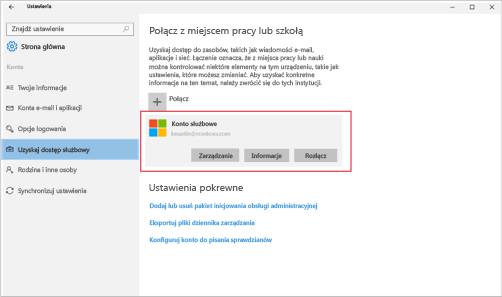

# Rozwiązywanie problemów dotyczących rejestrowania urządzeń z systemem Windows 10
Jeśli urządzenie zostało zarejestrowane, ale nadal nie można uzyskać dostępu do służbowego konta e-mail i plików, wykonaj następujące czynności w celu rozwiązania tego problemu.  

1.  Przyjrzyj się obu ekranom i zastanów się, który z nich przypomina zawartość ekranu urządzenia. Wykonaj kroki odnoszące się do ekranu przypominającego ekran urządzenia.

    Jeśli widzisz ten ekran, postępuj zgodnie z instrukcjami opisanymi w artykule [Rozwiązywanie problemów w przypadku wyświetlenia ekranu Dostęp do zasobów służbowych](#troubleshooting-steps-to-follow-if-you-see-access-work-or-school).

    

    Jeśli widzisz ten ekran, postępuj zgodnie z instrukcjami opisanymi w artykule [Rozwiązywanie problemów w przypadku wyświetlenia ekranu Konto użytkownika](#troubleshooting-steps-to-follow-if-you-see-your-account).

    

## Rozwiązywanie problemów w przypadku pozycji „Uzyskaj dostęp do miejsca pracy lub nauki”

1. Jeśli powyższe kroki zostały wykonane, ale nadal nie można uzyskać dostępu do służbowej poczty e-mail i plików, wróć do pozycji **Dostęp do zasobów służbowych**.

2. Wykonaj jedną z następujących czynności:

   - Jeśli widzisz połączenie, które wygląda podobnie do poniższego obrazu, wybierz je, a następnie sprawdź, czy widzisz opcje Zarządzanie, Informacje i Rozłącz. Jeśli widzisz te opcje, oznacza to, że nastąpiła rejestracja i zostało nawiązane połączenie.

     

   - Jeśli nie widzisz informacji o połączeniu pokazanych powyżej lub jeśli są one wyświetlane, ale brakuje niektórych opcji, naciśnij przycisk **Połącz**. Następnie zaloguj się przy użyciu poświadczeń konta służbowego, aby nawiązać połączenie.  

## Rozwiązywanie problemów w przypadku pozycji „Konto”

Jeśli powyższe kroki zostały wykonane, ale nadal nie można uzyskać dostępu do służbowej poczty e-mail, plików i innych danych, wróć do pozycji **Konta**, a następnie naciśnij pozycję **Dostęp z miejsca pracy**.

- Jeśli Twoje konto służbowe jest widoczne, oznacza to, że połączenie zostało nawiązane.  

- Jeśli nie widzisz konta służbowego, naciśnij pozycję **Połącz**, a następnie zaloguj się przy użyciu poświadczeń konta służbowego.

## Rozwiązywanie problemów w przypadku pozycji „Konfigurowanie konta służbowego”

Jeśli zostanie wyświetlony komunikat <strong>Nie można automatycznie odnaleźć punktu końcowego zarządzania zgodnego z podaną nazwą użytkownika. Sprawdź nazwę użytkownika i spróbuj ponownie. Jeśli znasz adres URL punktu końcowego zarządzania, wpisz go.</strong> Następnie należy ponownie wprowadzić nazwę użytkownika i hasło. Jeśli to nie zadziała, skontaktuj się z działem pomocy technicznej Twojej firmy w celu sprawdzenia witryny internetowej, którą musisz podać w polu tekstowym <strong>Punkt końcowy zarządzania</strong>. To jest witryna, której adres prawdopodobnie wygląda podobnie do tego: <strong>www.twojafirma.onmicrosoft.com</strong>.

Nadal potrzebujesz pomocy? Skontaktuj się z pomocą techniczną Twojej firmy. Informacje kontaktowe są dostępne w [witrynie sieci Web Portal firmy](https://go.microsoft.com/fwlink/?linkid=2010980).
