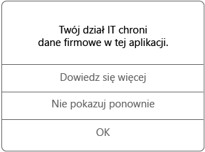

# Korzystanie z aplikacji zarządzanych na urządzeniu z systemem iOS

Aplikacje zarządzane to aplikacje, które administrator IT może skonfigurować w celu wspomagania ochrony danych firmowych dostępnych w tych aplikacjach. Gdy uzyskujesz dostęp do danych firmy w aplikacji zarządzanej na urządzeniu z systemem iOS, możesz zauważyć, że aplikacja działa w sposób nieco różniący się od oczekiwań. Na przykład może okazać się niemożliwe kopiowanie i wklejanie chronionych danych firmowych lub zapisywanie tych danych w określonych lokalizacjach.

Różne aplikacje zarządzane mogą również współpracować ze sobą na urządzeniu, aby umożliwić wykonywanie codziennych zadań z zachowaniem ochrony danych firmowych. Na przykład jeśli otwierasz plik firmowy w jednej aplikacji zarządzanej, a do wyświetlenia tego pliku jest wymagana inna aplikacja zarządzana, automatycznie otwiera się aplikacja zarządzana, która umożliwia wyświetlenie pliku. Jeśli wymagana aplikacja jest niedostępna, pewne akcje, takie jak otwieranie dokumentu lub uzyskiwanie dostępu do linku sieci Web z dokumentu zarządzanego, mogą być niedostępne.

Gdy uzyskujesz dostęp do danych firmowych w aplikacji zarządzanej, jest wyświetlany komunikat podobny do poniższego, który informuje o tym, że otwierana aplikacja jest zarządzana.

### Jak uzyskać aplikacje zarządzane?
Aplikacje zarządzane można uzyskać na kilka sposobów:

-   Gdy urządzenie jest zarejestrowane w usłudze Microsoft Intune, zainstaluj aplikację z aplikacji Portal firmy lub witryny internetowej Portal firmy. Aplikację może również zainstalować na Twoim urządzeniu administrator IT. Aby uzyskać informacje na temat rejestrowania, zobacz artykuł [Rejestrowanie urządzenia z systemem iOS w usłudze Intune](enroll-your-device-in-intune-ios.md) lub [Rejestrowanie urządzenia z systemem macOS w usłudze Intune](enroll-your-device-in-intune-macos.md).

-   Zainstaluj aplikację ze sklepu App Store, a następnie zaloguj się przy użyciu firmowego konta użytkownika, które jest zarządzane przez usługę Intune.

Administrator IT może czasami zakupić wiele licencji dla instalowanej przez Ciebie aplikacji. Jeśli zostanie wyświetlony komunikat z prośbą o zaakceptowanie umowy programu Apple Volume Purchase Program, jest to zjawisko normalne i można go zaakceptować. Jeśli go nie zaakceptujesz, nie będzie można zainstalować aplikacji.

### Czym może zarządzać mój administrator IT w aplikacji?
Oto kilka przykładowych opcji, którymi administrator IT może zarządzać w aplikacji i które mogą wpływać na interakcję z danymi firmowymi na urządzeniu:

-   Dostęp do określonych witryn sieci Web

-   Transfery danych między aplikacjami

-   Zapisywanie plików

-   Operacje kopiowania i wklejania

-   Wymagania dotyczące uzyskiwania dostępu za pomocą numeru PIN

-   Logowanie przy użyciu poświadczeń firmowych

-   Możliwość tworzenia kopii zapasowej w chmurze

-   Możliwość tworzenia zrzutów ekranu

-   Wymagania dotyczące szyfrowania danych

Aby uzyskać więcej informacji o aplikacjach zarządzanych na Twoim urządzeniu, skontaktuj się z administratorem IT. Informacje kontaktowe są dostępne w [witrynie sieci Web Portal firmy](http://portal.manage.microsoft.com).
