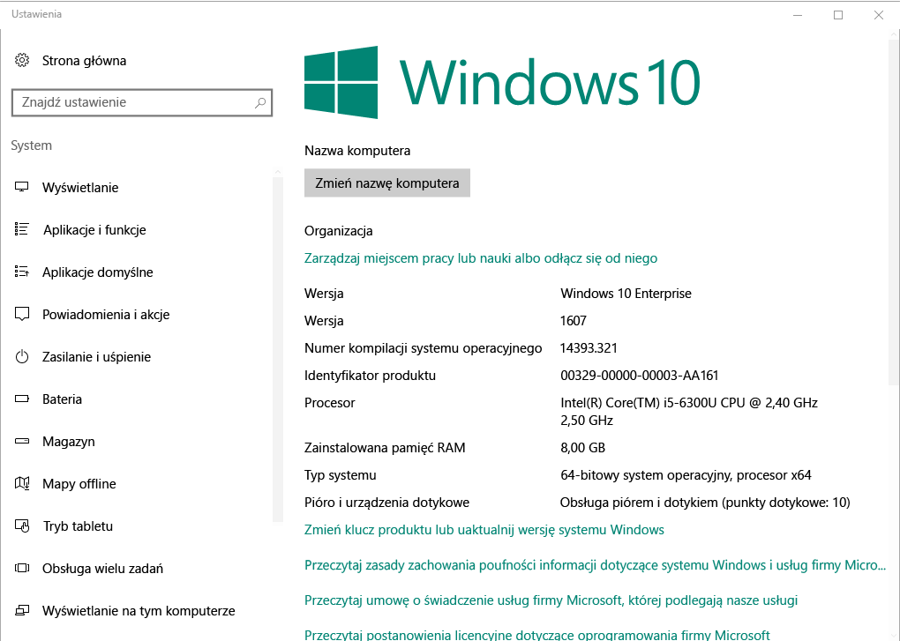

# Rejestracja urządzeń Windows w aplikacji Portal firmy usługi Intune  

Rejestrowanie urządzenia z systemem Windows w aplikacji Portal firmy usługi Intune, aby uzyskać bezpieczny dostęp do pracy i szkolnych aplikacji, wiadomości e-mail i plików. Jeśli Twoja organizacja wymaga lub zaleca niektóre aplikacje, np. Office lub usługi OneDrive, albo otrzymasz je podczas rejestracji lub będą dostępne w aplikacji Portal firmy po rejestracji.  

Możesz zarejestrować urządzenia z systemem Windows 10 za pośrednictwem witryny internetowej Portal firmy *lub* aplikacji. W przypadku zarejestrowania urządzenia z wcześniejszą wersją systemu Windows, musisz zarejestrować urządzenia za pośrednictwem witryny internetowej Portal firmy.  

## Aplikacja Portal firmy instalacji  
Być może masz już zainstalowaną na swoim urządzeniu aplikację Portal firmy. Wyszukaj aplikację w swojej __wszystkie aplikacje__ listy.  Jeśli lista nie zawiera aplikacji Portal firmy, wykonaj następujące kroki, aby ją zainstalować.  

1. Otwórz **Microsoft Store** na urządzeniu.

2. W **wyszukiwania** wpisz **aplikacji Portal firmy**.

3. Na liście wyników wybierz kolejno pozycje **Portal firmy** > **Zainstaluj**.

4. Wybierz pozycję **Zainstaluj** lub **Bezpłatne**. Nie ma żadnej różnicy między tymi dwiema opcjami; wyrazy są wyświetlane w zależności od sposobu skonfigurowania aplikacji swojej organizacji.  

## Znajdź numer wersji systemu Windows 10  
Kroki rejestracji różnią się dla różnych wersji urządzeń z systemem Windows 10. W poniższych krokach opisano, jak znaleźć numer wersji w systemie Windows 10 desktop i urządzenia przenośne. Po znasz używanej wersji, przejdź do procedury zalecane rejestracji.  

### Urządzenia z systemem Windows 10 Desktop  

1. Przejdź do pozycji **Start**.

2. Na pasku wyszukiwania wpisz "informacje o"komputerze. Wybierz __informacje o komputerze__ z wyników.  

     

3. Przewiń w dół do **specyfikacje Windows** można znaleźć **wersji** systemu Windows 10, który jest zainstalowany na komputerze z systemem.  

     

4. Jeśli jest w wersji  

    *  __1607 lub nowszej__: rejestrowanie urządzenia za [ **ustawienia** > **konta** > **dostęp do zasobów służbowych**trasy](enroll-windows-10-device.md#enroll-windows-10-version-1607-and-later-device).   
    * __1511 lub wcześniejszej__: rejestrowanie urządzenia za [ **ustawienia** > **konta** > **konta** trasy](enroll-windows-10-device.md#enroll-windows-10-version-1511-and-earlier-device).  

### Urządzenia z systemem Windows 10 Mobile       

1.  Przejdź do __wszystkie aplikacje__ i wybierz __ustawienia__ aplikacji.  
2.  Wybierz pozycje __System__ > __Informacje__.      
3.  W obszarze __informacje o urządzeniu__, Znajdź __wersji__.  
4. Jeśli jest w wersji  

    *  __1607 lub nowszej__: rejestrację przy użyciu urządzenia [ **ustawienia** > **dostęp do zasobów służbowych** trasy](enroll-windows-10-device.md#enroll-windows-10-version-1607-and-later-device).   
    * __1511 lub wcześniejszej__: rejestrację przy użyciu urządzenia [ **ustawienia** > **kont** trasy](enroll-windows-10-device.md#enroll-windows-10-version-1511-and-earlier-device).  

## Rejestrowanie urządzeń innych niż Windows 10  
Aby zarejestrować inne obsługiwane urządzenia Windows za pośrednictwem witryny internetowej Portal firmy, skorzystaj z poniższych artykułów:   
* [Urządzenie z systemem Windows 8.1 lub Windows RT 8.1](enroll-your-W81-or-rt81-windows.md)  
* [Urządzenia Windows Phone 8.1](enroll-your-wp81-windows.md)    

## Następne kroki  
Teraz, gdy wiesz, obsługiwane urządzenia i numer wersji systemu Windows 10, przejdź do artykułu zalecane rejestracji.  
 
Aby uzyskać więcej informacji na temat zarządzania urządzeniami Portal firmy i jak oba są używane w szkołach i w pracy, zobacz następujące artykuły:  
* [Uzyskiwanie dostępu do zasobów służbowych przy użyciu urządzeń zarządzanych](use-managed-devices-to-get-work-done.md)  
* [Co się stanie po zarejestrowaniu urządzenia w usłudze Intune](what-happens-if-you-install-the-company-portal-app-and-enroll-your-device-in-intune-windows.md)  
* [Jakie informacje może zobaczyć moja organizacja, gdy zarejestruję swoje urządzenie?](what-info-can-your-company-see-when-you-enroll-your-device-in-intune.md)  

Potrzebujesz pomocy? Skontaktuj się z pomocą techniczną Twojej firmy. [Przejdź do witryny internetowej Portal firmy](https://go.microsoft.com/fwlink/?linkid=2010980) można znaleźć w organizacji IT informacje kontaktowe.  
