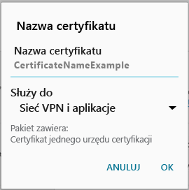

# Zainstaluj brakujące certyfikaty wymagane przez Twoją organizację  

Jeśli urządzenie nie jest zarejestrowane w usłudze Intune i nie ma wymaganego certyfikatu, nie będzie można zalogować się do aplikacji Portal firmy. Przy próbie zalogowania się zostanie wyświetlony następujący komunikat:

Dostępne są dwie opcje umożliwiające pobranie wymaganego certyfikatu i zarejestrowanie urządzenia. 

- Włącz dostęp do przeglądarki w aplikacji Portal firmy.
- Zidentyfikuj brakujący certyfikat na komputerze służbowym. Następnie przeszukaj Internet, aby pobrać brakujący certyfikat. 

Wykonaj kroki, aby najpierw włączyć dostęp do przeglądarki. Jeśli jednak nadal nie można zarejestrować urządzenia, wykonaj kroki, aby zlokalizować certyfikat w Internecie. 

## Włącz dostęp do przeglądarki
Wykonaj te kroki, aby włączyć dostęp do przeglądarki. Po włączeniu dostępu Portal firmy zainstaluje odpowiedni certyfikat i kontynuuje rejestrację.    

1. W aplikacji Portal firmy przejdź do odpowiedniego rogu i wybierz menu.  
2. Wybierz pozycję **Ustawienia**.  
3. Obok pozycji **Włącz dostęp do przeglądarki wybierz**pozycję **Włącz**.  
4. Na ekranie administrator urządzenia wybierz pozycję **Aktywuj**. 

## Identyfikowanie i pobieranie brakującego certyfikatu za pomocą wyszukiwania w sieci Web
Wykonaj następujące kroki, aby ręcznie zidentyfikować i zainstalować certyfikat na urządzeniu.  

1. Na komputerze otwórz przeglądarkę Internet Explorer. Jeśli nie masz komputera do użycia w tym celu, skontaktuj się z działem pomocy technicznej Twojej firmy. Aby znaleźć informacje kontaktowe działu pomocy technicznej Twojej firmy, sprawdź [witrynę internetową Portal firmy](https://go.microsoft.com/fwlink/?linkid=2010980).

2. Otwórz [witrynę sieci Web aplikacji Portal firmy](https://go.microsoft.com/fwlink/?linkid=2010980), a następnie zaloguj się przy użyciu poświadczeń konta służbowego.

3. Po prawej stronie paska adresu w przeglądarce wybierz symbol, który wygląda jak kłódka, jak pokazano na poniższym zrzucie ekranu.

    

    Jeśli nie widzisz symbolu kłódki, przerwij korzystanie z programu i skontaktuj się z działem pomocy technicznej Twojej firmy. Kłódka oznacza bezpieczne zalogowanie, więc użytkownik nie powinien kontynuować, jeśli nie widzi tego symbolu.

4. Wybierz pozycję **Wyświetl certyfikaty**.

    

5. Wybierz kartę **Ścieżka certyfikacji**, a następnie zidentyfikuj certyfikat, który należy pobrać z Internetu. Nazwa potrzebnego certyfikatu będzie znajdować się w tym samym miejscu, które zostało wyróżnione na poprzednim zrzucie ekranu.

6. Korzystając z wyszukiwarki, takiej jak Bing czy Google, wyszukaj nazwę brakującego certyfikatu, który został zidentyfikowany w poprzedniej sekcji. Certyfikat może mieć różne rozszerzenia, takie jak „crt”, „pem” itp.

7. Pobierz certyfikat główny z witryny sieci Web.

8. Po pobraniu certyfikatu przeciągnij w dół od górnej krawędzi urządzenia, aby otworzyć powiadomienia, a następnie wybierz nazwę certyfikatu na liście powiadomień.

4. W przedstawionym na poniższym zrzucie ekranu oknie dialogowym **Name the Certificate** (Nazywanie certyfikatu) zaakceptuj domyślną nazwę certyfikatu.

5. Upewnij się, że ustawienie **Credential Use** (Użycie poświadczeń) ma wartość **Used for VPN and apps** (Używane dla sieci VPN i aplikacji), a następnie naciśnij przycisk **OK**.

    

6. Zamknij aplikację Portal firmy.

7. Otwórz ponownie aplikację Portal firmy. Zalogowanie się do aplikacji Portal firmy powinno być teraz możliwe. Jeśli potrzebujesz pomocy, skontaktuj się z działem pomocy technicznej Twojej firmy.

Jeśli widzisz tę samą wiadomość „Brak certyfikatu” jak pokazana wcześniej i została już wykonana procedura, oznacza to prawdopodobnie, że istnieje inny certyfikat, który trzeba będzie zainstalować, korzystając z pomocy działu pomocy technicznej Twojej firmy. Skontaktuj się z działem pomocy technicznej Twojej firmy, aby uzyskać pomoc w zakresie korzystania z informacji kontaktowych dostępnych w [witrynie internetowej Portal firmy](https://go.microsoft.com/fwlink/?linkid=2010980).

## Następne kroki  

Nadal potrzebujesz pomocy? Skontaktuj się z pomocą techniczną Twojej firmy. Informacje kontaktowe są dostępne w [witrynie sieci Web Portal firmy](https://go.microsoft.com/fwlink/?linkid=2010980).  
